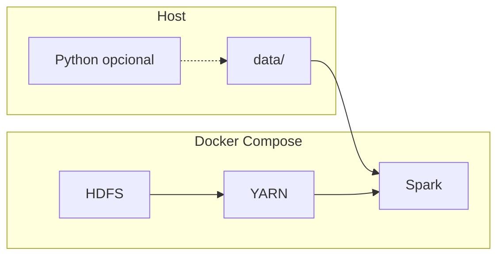

# Big Data - Indian Weather

Enunciado / rubrica da disciplina: [core.md](core.md).

<a id="indice"></a>

## Índice

- [Início rápido: arrancar o stack completo (Docker + Hadoop + Spark)](#inicio-rapido)
  - [Mapa do stack (visão geral)](#mapa-stack)
  - [Requisitos rápidos](#requisitos-rapidos)
  - [Notebooks PySpark no Jupyter (Docker)](#notebooks-jupyter-docker)
  - [Onde ler a seguir](#onde-ler-seguir)
- [Planeamento do projeto: marcos, histórias e tarefas](#planeamento-projeto)
  - [Como seguir o fluxo de trabalho](#fluxo-trabalho)
  - [Como concluir uma tarefa (checklist)](#checklist-tarefa)
- [Hub de documentação](#hub-documentacao)
- [Changelog de engenharia](#changelog-engenharia)
- [Ambiente virtual Python](#ambiente-python)
  - [Pré-requisitos](#venv-pre-requisitos)
  - [Criar o venv (uma vez por clone)](#venv-criar)
  - [Ativar o venv](#venv-ativar)
  - [Instalar dependências](#venv-instalar-deps)
  - [Correr (CSV para Parquet)](#venv-csv-parquet)
  - [Desativar](#venv-desativar)
  - [Editor (VS Code / Cursor)](#venv-editor)

---

<a id="inicio-rapido"></a>

## Início rápido: arrancar o stack completo (Docker + Hadoop + Spark)

Este repositório traz um **laboratório numa só máquina** (HDFS, YARN, histórico MapReduce, Spark) via **Docker Compose** na raiz. **Não** precisa de Python nem de ambiente virtual **só** para subir o cluster; Python serve para ferramentas no **host**, como CSV→Parquet.

<a id="mapa-stack"></a>

### Mapa do stack (visão geral)



> [!TIP]
> Reserve **pelo menos 8 GB de RAM** ao Docker; na primeira subida, aguarde pelos *healthchecks* até `docker compose ps` mostrar os serviços como **healthy**.

<a id="requisitos-rapidos"></a>

### Requisitos rápidos

| O quê | Mínimo / nota |
|--------|----------------|
| Docker + Compose | **Compose v2** (`docker compose version`). No Windows costuma ser **Docker Desktop** com **WSL2**. |
| RAM atribuída ao Docker | **≥ 8 GB** (16 GB ou mais é mais confortável para Hadoop + Spark). |
| Diretório de trabalho | Raiz do repositório (onde está `docker-compose.yml`). |
| Dados | `Indian_Weather_Dataset.parquet` em `data/` (ou `data/archive/` + variável no smoke). A pasta `data/` **não** vai para o Git (`.gitignore`). |

1. **Instalar Docker** com **Compose v2** (`docker compose version`). No Windows, **Docker Desktop** com backend WSL2 é o habitual. Atribua ao Docker **pelo menos 8 GB de RAM** (16 GB ou mais é mais confortável para Hadoop + Spark).
2. **Clonar** o repositório e abrir uma consola na **raiz do repositório** (a pasta que contém `docker-compose.yml`).
3. **Criar a pasta de dados** (o Compose faz bind-mount no Spark). PowerShell: `New-Item -ItemType Directory -Force -Path .\data | Out-Null`. Coloque **`Indian_Weather_Dataset.parquet`** em `data/` (ou em `data/archive/` e defina `T012_PARQUET_PATH` ao correr o smoke). A pasta `data/` está **no `.gitignore`**; tem de fornecer o conjunto de dados localmente ou gerar Parquet a partir do CSV (ver [Ambiente virtual Python](#ambiente-python) abaixo).
4. **Opcional:** copiar variáveis por defeito: `Copy-Item .env.example .env` (PowerShell) ou `cp .env.example .env` (macOS/Linux). Edite `.env` só se precisar de portas diferentes no host ou de outro `CLUSTER_NAME`.
5. **Pull e arranque:** `docker compose pull` e depois `docker compose up -d`. Aguarde pelos healthchecks: `docker compose ps` deve mostrar **healthy** nos serviços dependentes (a primeira subida pode demorar vários minutos).
6. **Verificar UIs:** [HDFS NameNode](http://localhost:9870), [YARN ResourceManager](http://localhost:8088), [Spark Master](http://localhost:8080), [Jupyter](http://localhost:8888) (PySpark no contentor). Tabela completa: [docker/README.md](docker/README.md#uis-e-health-checks).
7. **Smoke T012 (ler Parquet no Spark):** quando `spark-master` estiver **healthy**:

   ```powershell
   docker compose exec spark-master /spark/bin/spark-submit /opt/smoke/t012_smoke_parquet.py
   ```

   Se o Parquet estiver em `data/archive/`, defina o caminho dentro do contentor:

   ```powershell
   docker compose exec -e T012_PARQUET_PATH=/dataset/archive/Indian_Weather_Dataset.parquet spark-master /spark/bin/spark-submit /opt/smoke/t012_smoke_parquet.py
   ```

> [!WARNING]
> O comando `docker compose down -v` **apaga volumes** de dados do cluster (além de parar os contentores). Use só quando quiser repor o HDFS sem dados locais no volume.

8. **Parar:** `docker compose down` (mantém volumes HDFS). Para apagar volumes de dados do cluster: `docker compose down -v`.

<a id="notebooks-jupyter-docker"></a>

### Notebooks PySpark no Jupyter (Docker)

Para tarefas e modelos **Spark / MLlib** (ex.: `notebooks/decision_tree.ipynb`), o fluxo alinhado ao laboratório é:

1. Com o stack no ar (`docker compose up -d` e serviços **healthy**), abra no browser **[http://localhost:8888](http://localhost:8888)** (serviço `notebook` no Compose; porta configurável com `JUPYTER_PORT` no `.env`).
2. Execute os notebooks **a partir desse Jupyter**: o contentor usa o **Spark Standalone** da stack (`spark://spark-master:7077`), o mesmo mount de `./data` e a rede interna do Compose — não o mesmo ambiente que correr células só no kernel Python **local** do VS Code/Cursor no host.
3. A UI do **Spark Master** em [http://localhost:8080](http://localhost:8080) ajuda a confirmar aplicações e recursos.

O fluxo de branch, PR e evidências em `storyline/` (incluindo esta convenção) está em **[.cursor/skills/milestone-branch-workflow/SKILL.md](.cursor/skills/milestone-branch-workflow/SKILL.md)**.

<a id="onde-ler-seguir"></a>

### Onde ler a seguir

| Para quem | Documento |
|-------------|-------------|
| Arquitetura, portas, fluxo de dados e resolução de problemas num só sítio | [docs/guides/stack-completo-e-dados.md](docs/guides/stack-completo-e-dados.md) |
| Runbook do laboratório (comandos e troubleshooting com mais detalhe) | [docker/README.md](docker/README.md) |
| Porquê estas imagens e serviços (T010) | [docs/stack-apache.md](docs/stack-apache.md) |
| Índice de toda a documentação em `docs/` | [docs/README.md](docs/README.md) |

[↑ Voltar ao índice](#indice)

---

<a id="planeamento-projeto"></a>

## Planeamento do projeto: marcos, histórias e tarefas

A equipa regista o trabalho em Markdown em **[storyline/](storyline/)**. Essa pasta alinha-se ao `core.md` (**Parte 1–3** como **histórias** `S01`–`S03`, condicionadas por **marcos** `M01`–`M04`, decompostas em **tarefas** `T010`, `T020`, …).

| Começar aqui | Função |
|--------------|--------|
| [storyline/README.md](storyline/README.md) | Fluxo de trabalho, convenções de IDs, significados de estado, caminhos dos dados |
| [storyline/milestones/README.md](storyline/milestones/README.md) | Marcos ordenados (o que tem de ser verdade antes da fase seguinte) |
| [storyline/storys/README.md](storyline/storys/README.md) | Histórias = Parte 1, 2, 3; critérios de aceitação e tabelas de tarefas |
| [storyline/tasks/README.md](storyline/tasks/README.md) | Índice completo de tarefas por marco e história |

<a id="fluxo-trabalho"></a>

### Como seguir o fluxo de trabalho

1. Abrir o **marco ativo** em [storyline/milestones/README.md](storyline/milestones/README.md) (trabalhar **M01** antes de depender de **M02**, e assim por diante).
2. Abrir a **história** ligada a esse marco em [storyline/storys/](storyline/storys/) e ler critérios de aceitação e a tabela de tarefas.
3. Abrir ficheiros de **tarefa** em [storyline/tasks/](storyline/tasks/) por ordem de dependências: cada ficheiro tem `depends_on:` no bloco YAML (por exemplo concluir **T010** antes de **T011**).
4. Quando todas as tarefas do marco estiverem feitas e os critérios de saída cumpridos, considerar o marco concluído e avançar para o seguinte.

<a id="checklist-tarefa"></a>

### Como concluir uma tarefa (checklist)

Para cada ficheiro como [storyline/tasks/T010-docker-compose-stack.md](storyline/tasks/T010-docker-compose-stack.md):

1. **Ler** `depends_on` — não saltar pré-requisitos salvo decisão explícita da equipa.
2. **Executar** o descrito em **Objetivo** e marcar a **Checklist** no corpo Markdown (`- [x]` quando feito).
3. **Atualizar o bloco YAML** no topo: `status:` `Doing` em progresso, `Blocked` se estiver à espera de algo externo (por exemplo aprovação do docente), `Done` quando terminado.
4. **Preencher Evidence**: caminhos ou links a notebooks, ficheiros `docker/`, logs, PRs ou capturas para o revisor verificar sem adivinhar.
5. **Produzir artefactos** listados em `artifacts:` (criar caminhos se ainda não existirem).
6. Opcionalmente atualizar a coluna **Owner** / **Status** dessa tarefa na [história](storyline/storys/) para a tabela coincidir com a realidade.

**Valores de estado** (ver também [storyline/README.md](storyline/README.md)): `Todo`, `Doing`, `Blocked`, `Done`.

**Caminhos do conjunto de dados** (contexto das tarefas): `data/Indian_Weather_Dataset.parquet`; CSV opcional: `data/archive/Indian_Weather_Dataset.csv`.

---

<a id="hub-documentacao"></a>

## Hub de documentação

Para além deste ficheiro:

- **[docs/README.md](docs/README.md)** lista a documentação principal: **guia do stack**, **decisão de arquitetura**, **runbook Docker** e entradas de **changelog**.
- Os scripts têm documentação em Markdown em **[scripts/README.md](scripts/README.md)** (e um `.md` por script na mesma pasta).

---

<a id="changelog-engenharia"></a>

## Changelog de engenharia

Implementações relevantes (o que entrou, porquê, como verificar) ficam **um ficheiro Markdown por alteração maior** em [docs/changelog/](docs/changelog/) — índice em [docs/changelog/README.md](docs/changelog/README.md).

---

<a id="ambiente-python"></a>

## Ambiente virtual Python

Use um ambiente virtual para isolar dependências do Python do sistema.

<a id="venv-pre-requisitos"></a>

### Pré-requisitos

- Python 3 instalado e disponível como `python` (ou `python3` em macOS/Linux).

<a id="venv-criar"></a>

### Criar o venv (uma vez por clone)

Na raiz do repositório:

```bash
python -m venv .venv
```

Em alguns sistemas use `python3`:

```bash
python3 -m venv .venv
```

<a id="venv-ativar"></a>

### Ativar o venv

**Windows — PowerShell**

```powershell
Set-Location caminho\para\BigData
.\.venv\Scripts\Activate.ps1
```

Se a ativação for bloqueada pela política de execução, permita scripts para o seu utilizador (uma vez):

```powershell
Set-ExecutionPolicy -ExecutionPolicy RemoteSigned -Scope CurrentUser
```

**Windows — Prompt de comandos**

```bat
cd /d caminho\para\BigData
.venv\Scripts\activate.bat
```

**macOS / Linux — bash ou zsh**

```bash
cd caminho/para/BigData
source .venv/bin/activate
```

Com o venv ativo, o prompt costuma mostrar `(.venv)`.

<a id="venv-instalar-deps"></a>

### Instalar dependências

Com o venv ativo:

```bash
python -m pip install --upgrade pip
pip install -r requirements.txt
```

<a id="venv-csv-parquet"></a>

### Correr (CSV para Parquet)

Na raiz do repositório, com venv ativo e dependências instaladas:

```powershell
Set-Location c:\Desenvolvimento\BigData
pip install -r requirements.txt
python scripts\csv_to_parquet.py
```

Em macOS/Linux, use barras normais:

```bash
cd /caminho/para/BigData
pip install -r requirements.txt
python scripts/csv_to_parquet.py
```

<details>
<summary><strong>Referência: flags CLI e exemplos com <code>-i</code> / <code>-o</code></strong></summary>

**Flags opcionais**

| Flag | Descrição |
|------|-------------|
| `-i` / `--input` | Caminho do CSV de entrada |
| `-o` / `--output` | Caminho do Parquet de saída |
| `--compression` | `snappy`, `zstd` (por defeito), `gzip`, `lz4` ou `brotli` |
| `--read-block-mib N` | Tamanho do bloco do parser CSV em MiB (por defeito: `8`) |

**Exemplo com caminhos explícitos (Windows)**

```powershell
python scripts\csv_to_parquet.py -i data\archive\Indian_Weather_Dataset.csv -o data\archive\Indian_Weather_Dataset.parquet
```

**Exemplo (macOS/Linux)**

```bash
python scripts/csv_to_parquet.py -i data/archive/Indian_Weather_Dataset.csv -o data/archive/Indian_Weather_Dataset.parquet
```

</details>

O script foi testado com um CSV pequeno. Uma execução completa no CSV real do Indian Weather pode demorar muito porque o ficheiro fonte é muito grande.

<a id="venv-desativar"></a>

### Desativar

```bash
deactivate
```

<a id="venv-editor"></a>

### Editor (VS Code / Cursor)

Escolha o interpretador `.venv\Scripts\python.exe` (Windows) ou `.venv/bin/python` (macOS/Linux): **Python: Select Interpreter** na Paleta de Comandos para que terminais e depuração usem este ambiente.

---

[↑ Voltar ao índice](#indice)
