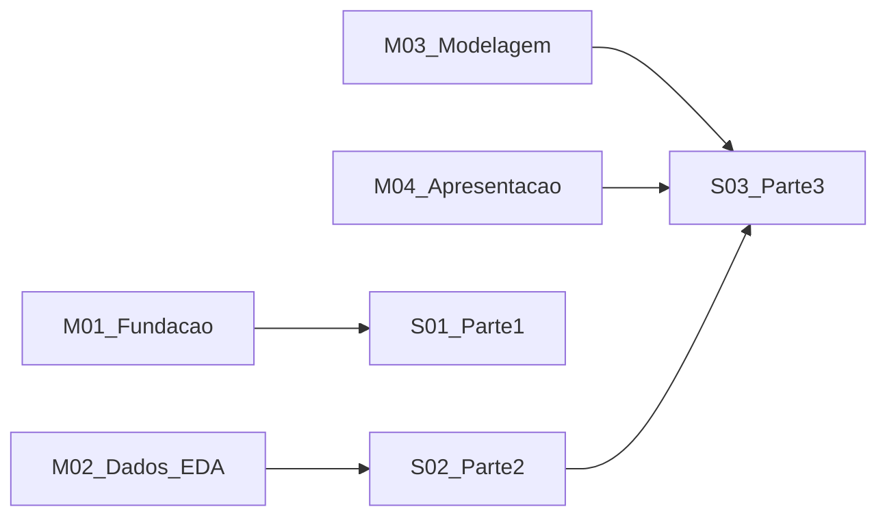

# Organização do projeto (milestones, storys, tasks)

Este diretório define **como acompanhar o trabalho** do projeto final alinhado ao enunciado em [core.md](../core.md).

## Fluxo de trabalho

1. Abrir o **milestone ativo** em [milestones/README.md](milestones/README.md).
2. Trabalhar as **storys** listadas para esse milestone em [storys/README.md](storys/README.md).
3. Executar e marcar **tasks** em [tasks/README.md](tasks/README.md) (um arquivo por task).
4. Considerar uma **story concluída** quando todos os critérios de aceite forem atendidos e as tasks ligadas estiverem em **Done**.
5. Considerar um **milestone concluído** quando os critérios de saída do milestone forem atendidos.

## Convenção de IDs

| Tipo | Formato | Exemplo |
|------|---------|---------|
| Milestone | `M01` … `M04` | `M02` |
| Story | `S01` … `S03` (1:1 com Parte 1–3) | `S02` |
| Task | `T010`, `T020`, … | `T021` |

Os números das tasks deixam espaço (`T015`, etc.) para inserir trabalhos novos sem reordenar tudo.

## Ciclo de vida do status (em cada arquivo de task)

Use um único campo **Status** no topo de cada task:

- `Todo` — ainda não iniciado
- `Doing` — em andamento
- `Blocked` — dependência externa (ex.: aprovação do professor)
- `Done` — concluído; preencher **Evidence** com caminho de notebook, log, PR, etc.

## Artefatos e dados

- Dataset em Parquet (referência do repositório): `data/Indian_Weather_Dataset.parquet`
- CSV arquivado (opcional): `data/archive/Indian_Weather_Dataset.csv`
- Conversão CSV → Parquet: ver [README.md](../README.md) (seção *How to run*).

## Estrutura de pastas

- [milestones/](milestones/) — marcos com datas-alvo e critérios de saída
- [storys/](storys/) — histórias = Parte 1, 2 e 3 do `core.md`
- [tasks/](tasks/) — itens executáveis com checklist e dependências
