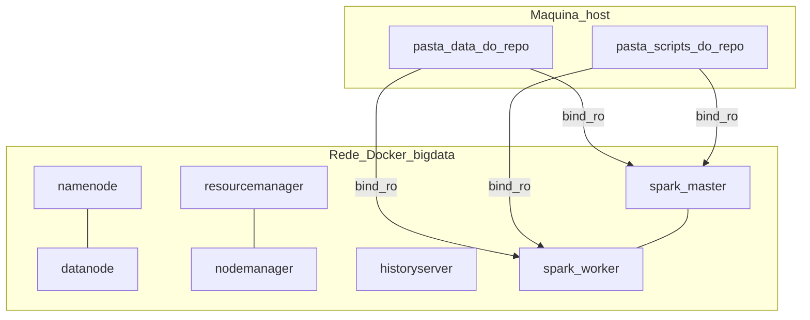

# Stack completo e dados: guia operacional aprofundado

Este guia explica **o que** o laboratório Docker fornece, **como** as peças ligam entre si e **como** subir tudo a partir de um clone limpo. Comandos prontos a copiar também estão em [`docker/README.md`](../../docker/README.md).

---

## 1. O que está a correr

O repositório inclui um **laboratório Hadoop + Spark numa só máquina** via **Docker Compose**:

| Camada | Neste repositório | Função |
|--------|-------------------|--------|
| HDFS | `namenode`, `datanode` | Armazenamento distribuído (metadados + blocos). URI por defeito: `hdfs://namenode:9000`. |
| YARN | `resourcemanager`, `nodemanager` | Gestor de recursos + execução por nó (narrativa de cluster). |
| Histórico MapReduce | `historyserver` | UI de histórico de jobs. |
| Spark | `spark-master`, `spark-worker` | Cluster Spark standalone; usado para o smoke **T012** em Parquet. |

As **imagens** estão fixadas (`bde2020`, Hadoop 3.2.1, Spark 3.2.1). Ver [`docs/stack-apache.md`](../stack-apache.md) para a tabela completa e a justificação.



---

## 2. Pré-requisitos

| Requisito | Notas |
|-----------|--------|
| **Docker Engine + Compose v2** | Deve funcionar `docker compose version` (não só o legado `docker-compose`). |
| **RAM** | **Mínimo 8 GB** para o Docker; **16+ GB recomendados**. O ficheiro [`docker/hadoop.env`](../../docker/hadoop.env) pode estar afinado a um perfil de máquina — se os contentores reiniciarem em ciclo, reduza memória YARN/MapReduce lá. |
| **Disco** | CSV/Parquet do Indian Weather pode ter **vários GB**. Garanta espaço no disco do repositório e dos volumes Docker. |
| **Portas** | Por defeito: `9870`, `9000`, `9864`, `8088`, `8042`, `8188`, `8080`, `7077`, `8081`. Nada mais no host deve ocupá-las. |
| **Windows** | **Docker Desktop** com backend WSL2 é o habitual. Os caminhos no Compose usam `./data` relativamente à pasta do `docker-compose.yml` (raiz do repo). |

**Python / `.venv`** **não** é obrigatório para o stack Hadoop/Spark. **É** necessário só para ferramentas no **host**, como [`scripts/csv_to_parquet.py`](../../scripts/csv_to_parquet.py) (PyArrow).

---

## 3. Estrutura do repositório (ficheiros relevantes)

| Caminho | Papel |
|---------|--------|
| [`docker-compose.yml`](../../docker-compose.yml) | Serviços, redes, volumes, healthchecks, **bind mounts** no Spark (`./data`, `./scripts`). |
| [`docker/hadoop.env`](../../docker/hadoop.env) | Propriedades Hadoop/YARN/MapReduce consumidas pelos entrypoints `bde2020` (ver comentários no ficheiro). |
| [`.env.example`](../../.env.example) / `.env` | Overrides opcionais do Compose (`CLUSTER_NAME`, portas). `.env` está no `.gitignore` — copiar de `.env.example`. |
| [`docker/README.md`](../../docker/README.md) | Operações, tabela de UIs, smoke **T012**, resolução de problemas. |
| `data/` | Pasta de dados **ignorada pelo Git**. Cria-se localmente. Parquet esperado: `Indian_Weather_Dataset.parquet` (raiz de `data/` ou em `archive/`). |
| [`scripts/t012_smoke_parquet.py`](../../scripts/t012_smoke_parquet.py) | Smoke PySpark montado em `/opt/smoke/` nos contentores Spark. |

---

## 4. Configuração inicial (a partir do clone)

### 4.1 Clonar e entrar no repositório

```powershell
git clone https://github.com/TalesAugusto1/Big_Data-Indian_Weather.git
Set-Location Big_Data-Indian_Weather
```

Use o seu fork/ramo se aplicável (por exemplo `M1`).

### 4.2 Criar a pasta de dados

O Compose monta `./data` no Spark. A pasta **tem de existir** no host (mesmo que vazia de início):

```powershell
New-Item -ItemType Directory -Force -Path .\data | Out-Null
```

Coloque **`Indian_Weather_Dataset.parquet`** em `data/` (ou converta a partir de CSV — ver secção Python no [`README.md`](../../README.md) na raiz).

### 4.3 Opcional: ficheiro de ambiente do Compose

```powershell
Copy-Item .env.example .env
```

Edite `.env` só se precisar de portas ou `CLUSTER_NAME` diferentes.

---

## 5. Arrancar o stack

Na **raiz do repositório** (onde está o `docker-compose.yml`):

```powershell
docker compose pull
docker compose up -d
docker compose ps
```

Aguarde até os serviços críticos mostrarem **healthy** (os healthchecks usam `curl` dentro dos contentores). A primeira subida pode demorar **vários minutos** (formatação HDFS, arranque YARN/Spark).

**Logs úteis:**

```powershell
docker compose logs -f namenode
docker compose logs -f resourcemanager
docker compose logs -f spark-master
```

---

## 6. Verificar no browser (ou com curl)

| Serviço | URL por defeito |
|---------|-----------------|
| UI HDFS NameNode | http://localhost:9870 |
| UI YARN ResourceManager | http://localhost:8088 |
| UI Spark Master | http://localhost:8080 |
| UI Spark Worker | http://localhost:8081 |
| MapReduce History Server | http://localhost:8188 |
| UI HDFS DataNode | http://localhost:9864 |
| UI YARN NodeManager | http://localhost:8042 |

---

## 7. T012: provar que o Parquet é legível no Spark

**Caminho por defeito dentro do contentor:** `file:///dataset/Indian_Weather_Dataset.parquet`  
(caminho no host: `.\data\Indian_Weather_Dataset.parquet`)

```powershell
docker compose exec spark-master /spark/bin/spark-submit /opt/smoke/t012_smoke_parquet.py
```

Se o ficheiro estiver em `data/archive/`, sobrescreva:

```powershell
docker compose exec -e T012_PARQUET_PATH=/dataset/archive/Indian_Weather_Dataset.parquet spark-master /spark/bin/spark-submit /opt/smoke/t012_smoke_parquet.py
```

Se `spark-submit` não estiver em `/spark/bin`, experimente `/opt/spark/bin/spark-submit` (depende da imagem).

**Varredura completa da tabela** (lenta em dados enormes) é opt-in:

```powershell
docker compose exec -e T012_FULL_COUNT=1 spark-master /spark/bin/spark-submit /opt/smoke/t012_smoke_parquet.py
```

Mais detalhe: secção **T012** em [`docker/README.md`](../../docker/README.md).

---

## 8. Opcional: copiar dados para o HDFS

O Spark monta `data/` do host por conveniência. Para também demonstrar **`hdfs dfs`**, copie primeiro para o contentor NameNode (o serviço **namenode** **não** monta `./data` por defeito):

```powershell
docker cp .\data\Indian_Weather_Dataset.parquet namenode:/tmp/Indian_Weather_Dataset.parquet
docker compose exec namenode hdfs dfs -mkdir -p /user/lab
docker compose exec namenode hdfs dfs -put -f /tmp/Indian_Weather_Dataset.parquet /user/lab/
docker compose exec namenode hdfs dfs -ls /user/lab
```

Depois o Spark pode ler `hdfs://namenode:9000/user/lab/Indian_Weather_Dataset.parquet` (defina `T012_PARQUET_PATH` em conformidade).

---

## 9. Parar e repor estado

**Parar contentores, manter volumes HDFS:**

```powershell
docker compose down
```

**Parar e apagar volumes nomeados** (apaga dados HDFS locais — use para cluster limpo):

```powershell
docker compose down -v
```

---

## 10. Python no host: CSV → Parquet (fora do Docker)

Usa **PyArrow** no host, não Spark dentro do Docker:

1. Criar/ativar `.venv` (ver [`README.md`](../../README.md) na raiz).
2. `pip install -r requirements.txt`
3. `python scripts/csv_to_parquet.py` com `-i`/`-o` nos caminhos do CSV/Parquet.

Ver também [`docs/changelog/2026-04-21-csv-to-parquet-streaming.md`](../changelog/2026-04-21-csv-to-parquet-streaming.md).

---

## 11. Resolução de problemas (resumo)

| Sintoma | O que tentar |
|---------|--------------|
| `dependency failed … unhealthy` | Esperar mais; aumentar RAM do Docker; ver `docker compose logs namenode`. |
| `port is already allocated` | Alterar portas no host via `.env` (ver `.env.example`). |
| Smoke Spark: `Parquet not found` | Garantir que o ficheiro existe em `.\data\…` e que o caminho coincide com `T012_PARQUET_PATH`. |
| Smoke Spark: `No module named pyspark` | Imagem sem PySpark; outro caminho de `spark-submit` ou `spark-shell` interativo (documente o workaround). |
| Ciclo de reinício YARN/NM | Reduzir memória em `docker/hadoop.env`, depois `docker compose down -v` e `up -d` de novo. |

Notas alargadas: [Troubleshooting em `docker/README.md`](../../docker/README.md#troubleshooting).

---

## 12. Enquadramento na disciplina

- **Parte 1 / M01** (este stack): [`storyline/milestones/M01-fundacao-big-data.md`](../../storyline/milestones/M01-fundacao-big-data.md) e história [`S01`](../../storyline/storys/S01-parte1-ambiente-docker-apache.md).
- **Rubrica:** [`core.md`](../../core.md).

---

## 13. Entradas de changelog nesta área

- [`docs/changelog/2026-04-21-stack-apache-m01.md`](../changelog/2026-04-21-stack-apache-m01.md) — T010, documentação do stack.
- [`docs/changelog/2026-04-21-docker-compose-m01.md`](../changelog/2026-04-21-docker-compose-m01.md) — T011, Compose + healthchecks.
- [`docs/changelog/2026-04-21-t012-dataset-smoke.md`](../changelog/2026-04-21-t012-dataset-smoke.md) — T012, mounts + script de smoke.
