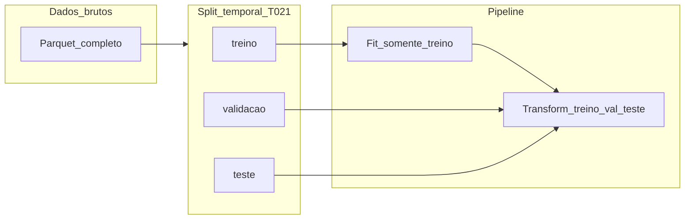

# Pipeline de pré-processamento (M02 / T022)

Este documento **especifica** o tratamento de dados para o Indian Weather, alinhado ao alvo **`rain_label`** (classificação, [T020](../organization/evidencias/aprovacao.md)) e ao **split temporal** por `datetime` ([T021](../storyline/tasks/T021-split-temporal-leakage.md), script [`split_temporal.py`](../scripts/split_temporal.py)).

## Restrições da equipa / disciplina

- **Não** usar **pandas** nem **scikit-learn** na implementação do pipeline (orientação da turma).
- Implementação futura recomendada: **Apache Spark** (DataFrame API, `MLlib` / `PipelineModel`) e/ou **PyArrow Compute** no host para transformações tabulares.
- Este ficheiro é a **especificação**; o código de materialização pode seguir na **T024** (EDA) ou num script dedicado posterior, desde que respeite fit só em treino.

## Fluxo lógico (fit vs transform)

1. Aplicar a **mesma regra temporal** da T021 (ordenar por `datetime`, cortes 70/15/15 ou os que estiverem fixados no script) para obter índices ou conjuntos `treino` / `validacao` / `teste`.
2. **Fit:** estimar parâmetros **apenas** no conjunto **treino** (vocabulários de categorias, médias/desvios, limiares TOP-K, imputações).
3. **Transform:** aplicar as mesmas transformações a **validação** e **teste**, usando só estatísticas aprendidas no treino (evita leakage).

## Formato de saída (artefactos)

| Artefacto | Descrição |
|-----------|-----------|
| `data/processed/indian_weather_train.parquet` | Treino após pipeline (sem colunas auxiliares de debug, ou com prefixo `_` se necessário). |
| `data/processed/indian_weather_val.parquet` | Validação. |
| `data/processed/indian_weather_test.parquet` | Teste. |

A pasta `data/` continua **fora do Git**; os caminhos são convenção local. Alternativa: **Hive-style** `data/processed/split=train|validation|test/part-*.parquet`.

**Não** versionar ficheiros gigantes no repositório; apenas documentar caminhos e comandos.

---

## Tabela coluna → tipo → transformação

Referência de colunas observadas no schema do dataset (smoke Spark / documentação do projeto). Ajustar se o Parquet local tiver diferenças.

| Coluna | Tipo lógico | Transformação |
|--------|-------------|----------------|
| `datetime` | timestamp | **Manter** como chave temporal; usada para split e possíveis features de calendário (já existem `hour`, `month`). |
| `state` | categórica (baixa/média cardinalidade) | **Ordinal encoding** aprendido no treino (mapa `categoria → int` estável) ou **one-hot** se o número de estados for pequeno. |
| `city` | categórica (alta cardinalidade) | **TOP-K por frequência no treino** + categoria **`__OTHER__`** para raros/fora do vocabulário; em val/teste mapear desconhecidos para `__OTHER__`. **Não** usar target encoding na T022 base (risco de leakage); se se usar mais tarde, fit **só** em treino com validação aninhada. |
| `crops` | texto / multi-rótulo | **Tokenização simples** + agregação (ex.: presença de palavras-chave) ou **TOP-K** de strings completas + `__OTHER__`, vocabulário só do treino. |
| `lat`, `lon` | numéricas contínuas | **StandardScaler** (média e desvio do **treino**) aplicado a val/teste; ou manter em graus se o modelo for baseado em árvores (opcional não escalar). |
| `temperature_C`, `humidity_pct`, `pressure_hPa`, `dew_point_C`, `pressure_trend`, `solar_radiation_Wm2`, `wind_speed_ms`, `cloud_cover_pct`, `wind_direction_deg`, `wind_dir_sin`, `wind_dir_cos`, `cape`, `et0_mm`, `precip_mm` | numéricas | **Imputação:** mediana do **treino** por coluna (robusto a outliers). **StandardScaler** para modelos lineares/NN; para **árvores**, imputação pode bastar sem scaling. |
| `hour`, `month` | inteiras / ordinais | Tratar como **numéricas** (scaling) ou **cíclicas** (sin/cos) se o modelo linear assim o exigir; árvores podem usar brutas. |
| `rain_label` | inteira (alvo classificação) | **Excluir** das features; **manter** só como coluna de alvo. |
| Duplicatas de nomes no schema (se existirem no ficheiro real) | — | **Deduplicar** colunas no carregamento (Spark `dropDuplicates` de nomes ou renomear) antes do pipeline. |

---

## Valores em falta (missing)

| Estratégia | Onde aplicar |
|------------|----------------|
| Numéricas: **imputação pela mediana** calculada no **treino**; aplicar a mesma mediana em val/teste. | Todas as numéricas exceto alvo. |
| Categóricas: categoria **`__MISSING__`** estável, contada no vocabulário do treino. | `state`, `city`, `crops`. |
| Se uma coluna estiver quase toda vazia | Avaliar **remoção** da feature (documentar decisão na T024). |

---

## Alta cardinalidade (`city`, `crops`)

1. **TOP-K (recomendado):** no treino, contar frequências; manter as **K** categorias mais frequentes (ex.: K=50 para `city`, K=30 para `crops` — ajustar por EDA na T024).
2. Todas as restantes mapear para **`__OTHER__`**.
3. Em val/teste: categorias desconhecidas → **`__OTHER__`** (nunca expandir o vocabulário com categorias só vistas em teste).
4. **Target encoding** só com **gating** explícito: não é parte do pipeline base desta especificação; se for usado, documentar **CV dentro do treino** e nunca usar estatísticas do val/teste no fit.

---

## Escalonamento (para linear / NN)

- Aplicar **standardização** \((x - \mu) / \sigma\) com \(\mu\) e \(\sigma\) do **treino** por coluna numérica escolhida.
- Guardar vetores \(\mu\), \(\sigma\) (ficheiro JSON ou lado a lado com o modelo Spark) para reprodutibilidade.

---

## Onde fazer **fit** e **transform**

| Etapa | Conjunto |
|--------|----------|
| Cálculo de medianas, TOP-K, mapas de categorias, \(\mu\)/\sigma\) | **Somente treino** |
| Aplicação das transformações | **Treino, validação e teste** (parâmetros fixos vindos do treino) |

---

## Ordem sugerida das etapas no job

1. Carregar Parquet (Spark ou PyArrow).
2. Aplicar máscara de split (labels `split` derivados da regra T021 ou join por intervalos de `datetime`).
3. **Fit** no subconjunto `split=treino`.
4. **Transform** nos três subconjuntos.
5. Escrever Parquet(s) de saída em `data/processed/`.

---

## Ligações

- Split temporal: [scripts/split_temporal.md](../scripts/split_temporal.md)
- Aprovação e alvo: [organization/evidencias/aprovacao.md](../organization/evidencias/aprovacao.md)
- Tarefa: [storyline/tasks/T022-preprocessamento-pipeline.md](../storyline/tasks/T022-preprocessamento-pipeline.md)
