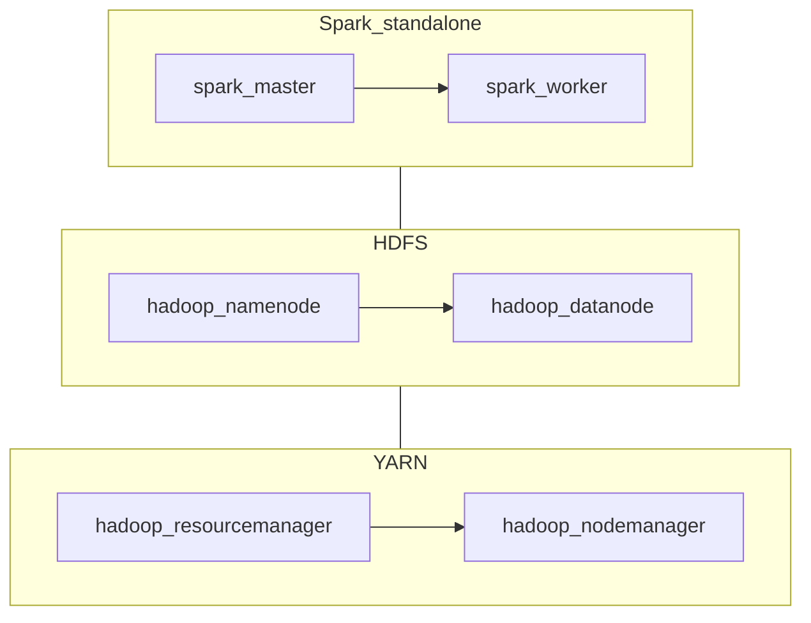

# Stack Apache em Docker (M01 — decisão de arquitetura)

Este documento atende a **T010** (escolha e documentação do ecossistema Apache) para o projeto **Big Data — Indian Weather**, alinhado ao [core.md](../core.md) e ao marco [M01](../storyline/milestones/M01-fundacao-big-data.md).

**Validação:** confirmar com o **docente** se a combinação de imagens e versões é aceitável para a disciplina antes de congelar o `docker compose` na **T011**.

## Requisitos mínimos do “cluster simulado”

- **Docker** (preferencialmente Docker Compose v2) para orquestrar múltiplos containers em uma única máquina (simulação de cluster).
- **Armazenamento distribuído (HDFS)** com separação lógica NameNode / DataNode(s).
- **Gerenciamento de recursos (YARN)** com ResourceManager / NodeManager(s) para executar aplicações no cluster.
- **Processamento Apache Spark** (master + worker(s)) para leitura/transformação em escala (ex.: leitura do Parquet do Indian Weather na **T012**).
- **Versões fixas (pin)** de todas as imagens para reprodutibilidade.

## Stack escolhido (proposta)

Conjunto **Big Data Europe (bde2020)** sobre **Hadoop 3.2.1** (Java 8) e **Spark 3.2.x** com suporte **Hadoop 3.2**, amplamente usado em material acadêmico e em repositórios de exemplo públicos.

| Serviço | Imagem Docker (tag fixa) | Papel | Portas típicas (referência) |
|---------|---------------------------|-------|-----------------------------|
| HDFS NameNode | `bde2020/hadoop-namenode:2.0.0-hadoop3.2.1-java8` | Metadados HDFS, namespace | `9870` (UI), `8020` (RPC) |
| HDFS DataNode | `bde2020/hadoop-datanode:2.0.0-hadoop3.2.1-java8` | Blocos de dados | `9864` (UI) |
| YARN ResourceManager | `bde2020/hadoop-resourcemanager:2.0.0-hadoop3.2.1-java8` | Agendamento de aplicações YARN | `8088` (UI) |
| YARN NodeManager | `bde2020/hadoop-nodemanager:2.0.0-hadoop3.2.1-java8` | Execução de containers YARN no nó | `8042` (UI) |
| MapReduce HistoryServer (opcional) | `bde2020/hadoop-historyserver:2.0.0-hadoop3.2.1-java8` | Histórico de jobs MR/Spark on YARN | `8188` (UI) |
| Spark Master | `bde2020/spark-master:3.2.1-hadoop3.2` | Coordenação do cluster Spark standalone | `7077`, `8080` |
| Spark Worker | `bde2020/spark-worker:3.2.1-hadoop3.2` | Execução de tarefas Spark | `8081` (por worker) |

As tags existem no Docker Hub (família `bde2020`). **Nota:** imagens comunitárias podem estar sem atualização há anos; para produção usaríamos imagens corporativas ou build próprio — para o **projeto acadêmico** o foco é reprodutibilidade e aderência ao ecossistema **Apache** via Docker.

## Topologia (visão lógica)

- **HDFS** guarda os dados (ex.: cópia do `Indian_Weather_Dataset.parquet` ingerida na T012).
- **YARN** fica disponível para workloads compatíveis (opcional na primeira subida; útil para narrativa “cluster Hadoop”).
- **Spark** lê/escreve via APIs sobre HDFS ou volumes montados na mesma rede Docker.

## Alternativas consideradas e rejeitadas (resumo)

- **Somente Spark + volume local**, sem HDFS/YARN: mais simples, mas **não** reflete o pedido de ecossistema **Apache Hadoop** simulado na Parte 1.
- **Kubernetes (K8s)**: fora do escopo imediato (Docker Compose atende ao enunciado).
- **Nuvem gerenciada (EMR, Dataproc, Databricks)**: não simula cluster **local** com Docker no repositório.
- **Bitnami / Apache oficial**: alternativas válidas; **bde2020** foi escolhida por abundância de exemplos `docker-compose` públicos (facilita a **T011**).

## T011 (implementado) — Compose e health checks

- **`docker-compose.yml`** na **raiz** do repositório: rede `bigdata`, serviços HDFS + YARN + HistoryServer + Spark (pins iguais à tabela acima), `healthcheck` com `curl` e `depends_on` com `service_healthy`.
- **`docker/hadoop.env`**: variáveis `CORE_CONF_*`, `HDFS_CONF_*`, `YARN_CONF_*`, `MAPRED_CONF_*` (base [big-data-europe/docker-hadoop](https://github.com/big-data-europe/docker-hadoop)), com **memória reduzida** para laptops.
- **`.env.example`**: `CLUSTER_NAME` e portas opcionais; copiar para `.env` (ficheiro ignorado pelo Git).
- **`docker/README.md`**: comandos `up`/`down`/`logs`, tabela de UIs e troubleshooting.

## T012 (implementado) — Dados e smoke Parquet

- Mount `./data` → `/dataset` (ro) e `./scripts` → `/opt/smoke` (ro) nos serviços Spark no **`docker-compose.yml`**.
- Smoke: **`scripts/t012_smoke_parquet.py`** + secção **T012** em **`docker/README.md`** (URI `file:///dataset/...`, opção HDFS com `docker cp`).

## Guia operacional completo

Para **passo a passo desde o clone** (pré-requisitos, mounts, T012, HDFS opcional, `down -v`): [guides/stack-completo-e-dados.md](guides/stack-completo-e-dados.md). Índice geral da pasta `docs/`: [README.md](README.md).

## Referências

- Repositório de referência (compose Hadoop): [big-data-europe/docker-hadoop](https://github.com/big-data-europe/docker-hadoop)
- Imagens: organização [bde2020 no Docker Hub](https://hub.docker.com/u/bde2020/)
